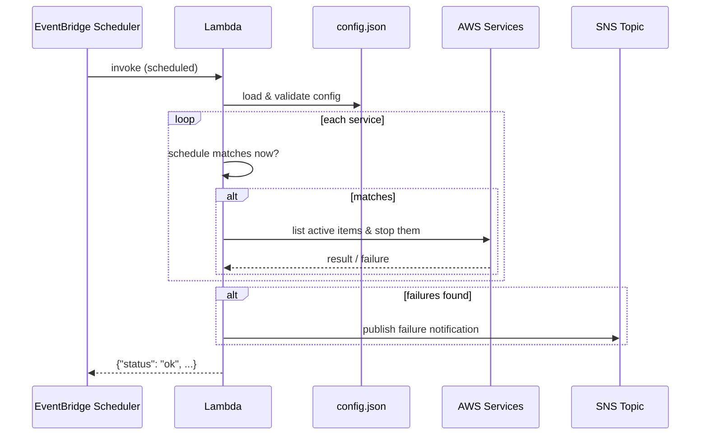

# aws-lambda-shutdown

A serverless solution that **forcibly shuts down AWS services that are running indefinitely**, driven entirely by a single JSON configuration file. It uses an AWS Lambda function to stop resources and EventBridge Scheduler to trigger it on the configured days and times.

---

## Features

- **Config-driven**: one `config.json` defines the general schedule, the notification email, and the list of services to shut down.
- **9 supported services**: EC2, RDS, ECS, Glue (batch & streaming), Aurora, Batch, DMS, and DMS Serverless.
- **Per-service schedules**: each service can override the general schedule (days/times as a list).
- **Idempotent scheduler generation**: EventBridge Schedulers are created/removed to match the config exactly — safe to re-run.
- **Failure notifications**: an SNS email is sent when items fail to shut down or when a configuration error occurs.
- **Terraform-managed infrastructure** (no CloudFormation).
- **Fully unit-tested** (39 tests) with dependency injection for easy testing.

---

## Architecture

```mermaid
flowchart LR
    subgraph Config
        CF[config.json<br/>local or S3]
    end

    subgraph Management
        CLI[generate-schedulers CLI<br/>or Lambda handler]
        GEN[SchedulerGenerator]
    end

    subgraph AWS
        ES[EventBridge Scheduler]
        L[Lambda<br/>aws-lambda-shutdown]
        SNS[SNS Topic]
        EMAIL[Email<br/>jamilvilela@gmail.com]
        SVC[EC2 / RDS / ECS / Glue /<br/>Aurora / Batch / DMS / DMS-Serverless]
    end

    CF --> CLI
    CLI --> GEN
    GEN -->|create/delete schedules| ES
    ES -->|invoke on schedule| L
    L -->|read config| CF
    L -->|stop resources| SVC
    L -->|publish failures| SNS
    SNS --> EMAIL
```

**Components**

| Component | Purpose |
|---|---|
| `config.json` | Single source of truth: general schedule, notification email, services list. |
| `SchedulerGenerator` | Reads the config and creates one EventBridge Scheduler per unique time (idempotent). |
| `lambda_handler` | Entry point invoked by EventBridge Scheduler. Loads/validates config, matches the schedule, and shuts down active items. |
| `ServiceFactory` + handlers | Maps each service name to a handler that lists active items and stops them. |
| `SNSNotifier` | Publishes failure/error notifications to the SNS topic (email subscription). |

---

## How it works

### 1. Scheduler generation (creating the services)

EventBridge Schedulers are **not** managed by Terraform because their schedule depends on the JSON config. Instead, they are generated from `config.json`:

1. For each service, the effective schedule is resolved (`service.schedule` or `general.schedule`).
2. For each unique time in the effective schedules, a scheduler named `shutdown-<HHMM>` is created with a cron expression like `cron(0 3 ? * MON,WED,FRI *)` (UTC). When it fires, the Lambda inspects `config.json` and shuts down **all** services whose schedule matches that time.
3. Existing `shutdown-*` schedulers that are no longer in the config are deleted.
4. The operation is **idempotent** — re-running only creates missing schedulers and removes stale ones.

This can be run via the CLI (`generate-schedulers`) or the `generate_schedulers_handler` Lambda entry point.

### 2. Lambda execution (shutting down services)

When an EventBridge Scheduler fires, it invokes `lambda_handler`:

1. **Load & validate** the config (from a local file or `s3://` URL) using Pydantic models.
2. **Match the schedule** — for each service, check if the current day/time is in its effective schedule; skip it otherwise.
3. **Shut down** — for each matching service, the factory creates the appropriate handler, which lists active items and stops them (e.g. `ec2:StopInstances`, `rds:StopDBInstance`, `ecs:UpdateService` with `desiredCount=0`, `batch:TerminateJob`, `dms:StopReplicationTask`, etc.).
4. **Notify** — if any item failed to shut down, an SNS email is sent with the list of failures. If the config itself is invalid/missing, an error notification is sent and the exception is re-raised.



---

## Project structure

```
aws-lambda-shutdown/
├── config.json                  # Configuration: schedule, email, services
├── src/
│   ├── handler.py               # lambda_handler + generate_schedulers_handler
│   ├── notifier.py              # SNS failure/error notifications
│   ├── __main__.py              # CLI (generate-schedulers)
│   ├── config/
│   │   ├── models.py            # Pydantic models (Schedule, Service, Config...)
│   │   ├── loader.py            # Load config from file or S3
│   │   ├── validator.py         # Validate config via Pydantic
│   │   └── schema.json          # JSON Schema for the config
│   ├── schedule/
│   │   └── matcher.py           # Day/time matching logic
│   ├── scheduler/
│   │   └── generator.py         # EventBridge Scheduler create/delete
│   └── services/
│       ├── base.py              # ServiceHandler ABC + Failure
│       ├── registry.py          # service name → handler class
│       ├── factory.py           # handler creation with DI
│       └── *_handler.py         # one handler per service
├── infra/                       # Terraform module (main, iam, sns, s3, variables, outputs...)
├── tests/unit/                  # 39 unit tests
├── docs-sdd/                    # SDD documentation (feature, prd, architecture...)
├── requirements.txt             # Runtime dependencies
└── requirements-dev.txt         # Test dependencies
```

---

## Configuration (`config.json`)

```json
{
  "general": {
    "schedule": {
      "daysOfWeek": ["SUN", "MON", "TUE", "WED", "THU", "FRI", "SAT"],
      "times": ["03:00", "06:00", "22:00", "23:59"]
    },
    "notification": {
      "email": "jamilvilela@gmail.com"
    }
  },
  "services": [
    { "name": "ec2" },
    { "name": "rds" },
    { "name": "ecs" },
    { "name": "glue-batch" },
    { "name": "glue-stream" },
    { "name": "aurora" },
    { "name": "batch" },
    { "name": "dms" },
    { "name": "dms-serverless" }
  ]
}
```

- **`general.schedule`** — default days (`MON`–`SUN`) and times (`HH:MM`, 24h, UTC) applied to services without their own schedule.
- **`general.notification.email`** — email that receives failure/error notifications.
- **`services[]`** — each entry can add an optional `schedule` to override the general one:

```json
{ "name": "ec2", "schedule": { "daysOfWeek": ["MON", "FRI"], "times": ["22:00"] } }
```

### Supported services

| Service name | What gets stopped |
|---|---|
| `ec2` | EC2 instances (`StopInstances`, force) |
| `rds` | RDS DB instances (`StopDBInstance`) |
| `ecs` | ECS services (`UpdateService`, `desiredCount=0`) |
| `glue-batch` | Glue batch job runs (`BatchStopJobRun`) |
| `glue-stream` | Glue streaming job runs (`BatchStopJobRun`) |
| `aurora` | Aurora DB clusters (`StopDBCluster`) |
| `batch` | AWS Batch jobs (`TerminateJob`) |
| `dms` | DMS replication tasks & instances (`StopReplicationTask`/`StopReplicationInstance`) |
| `dms-serverless` | DMS Serverless replications (`StopReplication`) |

---

## Prerequisites

- Python 3.11+
- AWS CLI configured with credentials (`aws configure`)
- Terraform >= 1.5
- An AWS account with the services you intend to shut down

---

## Step-by-step usage

### 1. Local setup

```bash
python -m venv .venv
# Windows
.venv\Scripts\activate
# macOS/Linux
source .venv/bin/activate

pip install -r requirements-dev.txt
```

### 2. Edit the configuration

Fill in `config.json` with your services, schedules, and notification email.

### 3. Run the tests

```bash
pytest tests/ -v
```

### 4. Package the Lambda

Create a zip containing `src/` and the runtime dependencies (boto3 and pydantic are bundled in the Lambda runtime layer or must be included):

```bash
# Example: package with dependencies into a deployment zip
mkdir -p build
cp -r src build/
pip install -r requirements.txt --target build/
cd build && zip -r ../lambda-package.zip . && cd ..
```

### 5. Deploy the infrastructure with Terraform

```bash
cd infra
cp terraform.tfvars.example terraform.tfvars
# edit terraform.tfvars: region, notification_email, config_bucket_name, lambda_package_path

terraform init
terraform plan
terraform apply
```

This provisions the SNS topic + email subscription, the S3 bucket for `config.json`, the Lambda IAM role/policy, the Lambda function, and the scheduler IAM role.

### 6. Upload the config to S3

```bash
aws s3 cp config.json s3://<config_bucket_name>/config.json
```

### 7. Generate the EventBridge Schedulers

Set the required environment variables (from the Terraform outputs) and run the CLI:

```bash
export LAMBDA_ARN=<lambda_arn>
export SCHEDULER_ROLE_ARN=<scheduler_role_arn>

python -m src generate-schedulers
```

This creates one scheduler per unique time (`shutdown-0300`, `shutdown-2200`, ...). Re-run it any time you change `config.json` — it is idempotent and removes stale schedulers.

### 8. Verify

- Check the EventBridge Scheduler console for the `shutdown-*` schedules.
- Trigger the Lambda manually (or wait for a scheduled run) and confirm resources are stopped.
- Check the SNS email for any failure/error notifications.

---

## Environment variables

| Variable | Used by | Description |
|---|---|---|
| `CONFIG_FILE` | Lambda / CLI | Path to config: local file or `s3://bucket/key` (default `config.json`). |
| `SNS_TOPIC_ARN` | Lambda | SNS topic for failure/error notifications. |
| `FALLBACK_NOTIFICATION_EMAIL` | Lambda | Fallback email used when the config is missing/invalid. |
| `LAMBDA_ARN` | CLI / scheduler handler | ARN of the Lambda targeted by EventBridge Scheduler. |
| `SCHEDULER_ROLE_ARN` | CLI / scheduler handler | IAM role ARN used by EventBridge Scheduler to invoke the Lambda. |

---

## Documentation

Full SDD documentation (feature, PRD, architecture, plan, tasks, agents, skill, tests) lives in [`docs-sdd/`](docs-sdd/). 
