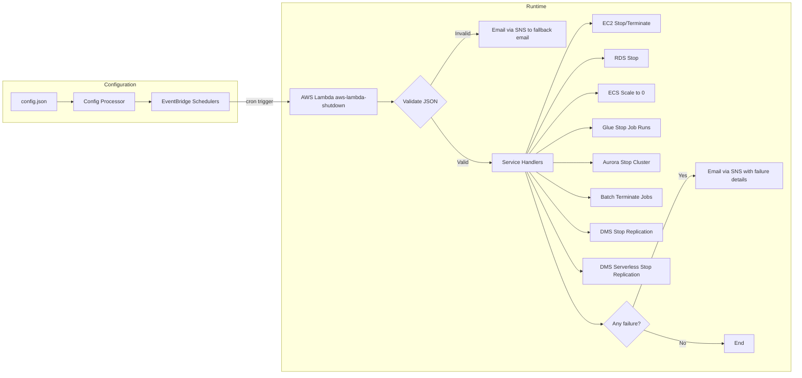
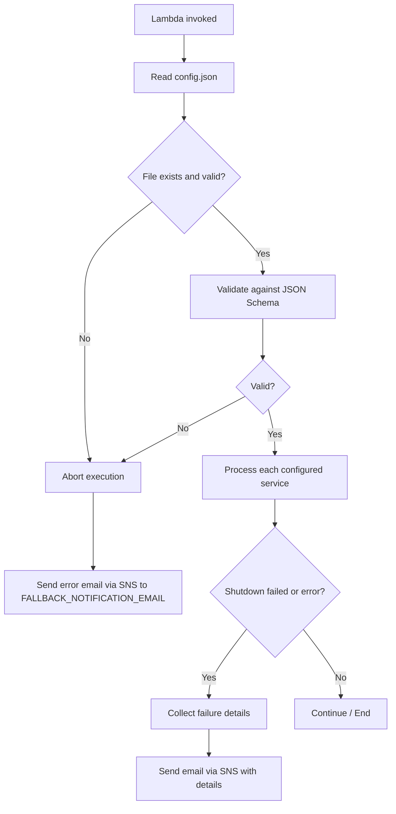

# Technical Architecture — AWS Lambda Shutdown of AWS Services

## High-Level Architecture



## Component Breakdown

| Component | Description |
|-----------|-------------|
| **AWS Lambda** (`aws-lambda-shutdown`) | Python 3.11 function that reads the config, validates it, and shuts down services. |
| **config.json** | JSON configuration file (in the Lambda package or an S3 bucket) defining services, schedules, and notification settings. |
| **SNS Topic** (`aws-lambda-shutdown-sns`) | Email-subscribed topic used for failure notifications. |
| **EventBridge Schedulers** | Schedules that trigger the Lambda per unique time. They are always created **ENABLED** from the union of all services' effective schedules; the per-service `enabled` flag does not affect them (the Lambda skips disabled services at runtime). |
| **IAM Role** | Least-privilege role granting the Lambda permissions to describe/stop resources and publish to SNS. |
| **Terraform** | Infrastructure as Code tool used to provision the Lambda, SNS topic, IAM role, and EventBridge Schedulers. |

## Data Flow

1. **Configuration phase:** `config.json` is read and used to generate EventBridge Schedulers (one per unique time) from the union of all services' effective schedules; schedulers are always created **ENABLED**, and the per-service `enabled` flag only affects the Lambda at runtime (disabled services are skipped).
2. **Trigger:** An EventBridge Scheduler invokes the Lambda at the configured time and days.
3. **Load & validate:** The Lambda reads `config.json` and validates it against a JSON Schema.
4. **Schedule matching:** For each configured service, the Lambda checks whether the current time/day matches the service schedule (specific or inherited from general).
5. **Shutdown:** For matching services, the Lambda lists all active items and forcibly shuts them down.
6. **Notify:** If any item fails or an error occurs, an email is published to SNS.

## Error-Handling Flow



## AWS Resource Naming Conventions

| Resource | Naming Pattern | Example |
|----------|----------------|---------|
| Lambda function | `aws-lambda-shutdown` | `aws-lambda-shutdown` |
| SNS topic | `aws-lambda-shutdown-sns` | `aws-lambda-shutdown-sns` |
| EventBridge Scheduler | `shutdown-<HHMM>` | `shutdown-0300` |
| Configuration file | `config.json` | `config.json` |

## Environment Variables

| Variable | Description |
|----------|-------------|
| `CONFIG_FILE` | Path to `config.json`. |
| `SNS_TOPIC_ARN` | ARN of the SNS topic used for notifications. |
| `FALLBACK_NOTIFICATION_EMAIL` | Email used when the JSON is missing/invalid (`jamilvilela@gmail.com`). |

## IAM Permissions (Lambda Role)

- `ec2:DescribeInstances`, `ec2:StopInstances`, `ec2:TerminateInstances`
- `rds:DescribeDBInstances`, `rds:StopDBInstance`
- `rds:DescribeDBClusters`, `rds:StopDBCluster` (Aurora)
- `ecs:ListServices`, `ecs:DescribeServices`, `ecs:UpdateService`
- `glue:GetJobs`, `glue:GetJobRuns`, `glue:BatchStopJobRun` (Glue batch and streaming)
- `batch:DescribeJobs`, `batch:CancelJob`, `batch:TerminateJob`
- `dms:DescribeReplicationTasks`, `dms:DescribeReplicationInstances`, `dms:StopReplicationTask`, `dms:StopReplicationInstance`
- `dms:DescribeReplicationConfigs`, `dms:StopReplication` (DMS Serverless)
- `sns:Publish`
- `scheduler:CreateSchedule`, `scheduler:GetSchedule`, `scheduler:ListSchedules`, `scheduler:DeleteSchedule`
- `s3:GetObject` (if `config.json` is stored in S3)

## Design Patterns

| Pattern | Application |
|---------|-------------|
| **Repository** | Wraps AWS SDK clients (EC2, RDS, ECS, Glue, Aurora, Batch, DMS, DMS Serverless) behind a common interface. |
| **Strategy** | Per-service shutdown logic (EC2 stop, RDS stop, ECS scale-to-zero, Glue stop jobs, Aurora stop cluster, Batch terminate jobs, DMS stop replication, DMS Serverless stop replication). |
| **Factory** | Creates the appropriate service handler based on the service name. |
| **Singleton** | Caches the parsed configuration for the Lambda execution. |
| **Dependency Injection** | Injects AWS clients and notifier into handlers for testability. |
| **Error handling** | try/except with structured logging and failure aggregation. |

## Deployment (Infrastructure as Code)

All AWS resources (Lambda function, SNS topic, IAM role, EventBridge Schedulers, and optional S3 bucket) must be provisioned with **Terraform**. CloudFormation and other IaC frameworks must not be used.

### Terraform Module Structure

The Terraform module in `infra/` follows a standard file layout. `main.tf` contains only the main resources of the project (the Lambda function and its invocation permission); auxiliary resources are split into dedicated files per service.

```
infra/
├── data.tf            # Data sources (e.g., aws_caller_identity)
├── locals.tf          # Local values (name prefix, common tags)
├── main.tf            # Main resources: Lambda function + invocation permission
├── outputs.tf         # Terraform outputs
├── terraform.tfvars   # Actual variable values
├── variables.tf       # Input variables
├── versions.tf        # Terraform version + AWS provider
├── iam.tf             # IAM roles/policies (Lambda + Scheduler)
├── sns.tf             # SNS topic + email subscription
└── s3.tf              # S3 bucket for config.json
```

| File | Contents |
|------|----------|
| `versions.tf` | `terraform` block, required version, AWS provider. |
| `variables.tf` | Input variables (`region`, `notification_email`, `config_bucket_name`, `lambda_package_path`). |
| `locals.tf` | Local values: `name_prefix` and `common_tags`. |
| `data.tf` | Data sources (e.g., `aws_caller_identity`). |
| `main.tf` | Main resources only: `aws_lambda_function.shutdown` and `aws_lambda_permission.scheduler_invoke`. |
| `iam.tf` | IAM roles and policies for the Lambda and for EventBridge Scheduler. |
| `sns.tf` | SNS topic and email subscription for notifications. |
| `s3.tf` | S3 bucket (and versioning) that stores `config.json`. |
| `outputs.tf` | Outputs consumed by the CLI (`lambda_arn`, `scheduler_role_arn`, etc.). |
| `terraform.tfvars` | Actual values for the input variables. |

EventBridge Schedulers are generated dynamically from `config.json` (see `src/scheduler/generator.py`) and are not declared in Terraform.