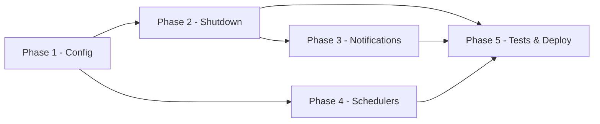

# Implementation Plan — AWS Lambda Shutdown of AWS Services

## Overview

The implementation is organized into five phases. Each phase delivers a testable increment and maps to the user stories in `docs-sdd/feature.txt`.

## Phases and Milestones

### Phase 1 — Configuration Parsing & Validation

**Goal:** Read and validate `config.json`.

| Task | Description | User Story |
|------|-------------|------------|
| P1.1 | Define JSON Schema for the configuration file. | US-001, US-002, US-003 |
| P1.2 | Implement configuration loader (file or S3). | US-001 |
| P1.3 | Implement JSON Schema validation and error handling. | US-001 |
| P1.4 | Implement fallback email handling for missing/invalid JSON. | US-001 |

**Milestone:** Configuration is loaded and validated; invalid config aborts with SNS notification.

### Phase 2 — Service Shutdown Logic

**Goal:** Forcibly shut down all items of each configured service.

| Task | Description | User Story |
|------|-------------|-------------|
| P2.1 | Implement service registry and handler factory. | US-004 |
| P2.2 | Implement EC2 handler (list + force stop/terminate). | US-004 |
| P2.3 | Implement RDS handler (list + stop). | US-004 |
| P2.4 | Implement ECS handler (list + scale to zero). | US-004 |
| P2.5 | Implement Glue handlers (batch + streaming, stop running job runs). | US-004 |
| P2.6 | Implement Aurora handler (list + stop clusters). | US-004 |
| P2.7 | Implement Batch handler (list + terminate running jobs). | US-004 |
| P2.8 | Implement DMS handler (list + stop replication tasks/instances). | US-004 |
| P2.9 | Implement DMS Serverless handler (list + stop replication configs). | US-004 |
| P2.10 | Implement schedule matching (days × times list, general inheritance). | US-002, US-003 |

**Milestone:** All configured services are forcibly shut down on schedule.

### Phase 3 — SNS Notifications

**Goal:** Notify the administrator on failure.

| Task | Description | User Story |
|------|-------------|-------------|
| P3.1 | Implement SNS notifier (publish email). | US-005 |
| P3.2 | Aggregate failures and build notification message. | US-005 |
| P3.3 | Send notification only when failures occur. | US-005 |

**Milestone:** Failure notifications are delivered with full details.

### Phase 4 — EventBridge Scheduler Generation

| Task | Description | User Story |
|------|-------------|-------------|
| P4.1 | Implement scheduler generation from configuration (one per unique time). | US-006 |
| P4.2 | Implement idempotency (no duplicate schedulers on re-run). | US-006 |
| P4.3 | Implement cleanup of removed configurations. | US-006 |
| P4.4 | Implement per-service enable/disable via `services[].enabled` (Lambda skips disabled services; schedulers always created ENABLED and unaffected). | US-007 |

**Milestone:** Schedulers are generated per unique time, idempotent, cleaned up, and individual services can be paused via `services[].enabled`.

### Phase 5 — Tests & Deployment

| Task | Description | User Story |
|------|-------------|-------------|
| P5.1 | Write unit tests (pytest + mocks/moto). | All |
| P5.2 | Write integration tests. | All |
| P5.3 | Write acceptance tests mapped to user stories. | All |
| P5.4 | Package and deploy the Lambda with **Terraform** (no CloudFormation); structure the module into standard files (`data.tf`, `locals.tf`, `main.tf`, `outputs.tf`, `terraform.tfvars`, `variables.tf`, `versions.tf`) with auxiliary resources (IAM, SNS, S3) in dedicated per-service files. | All |

**Milestone:** Solution is tested and deployable.

## Dependencies Between Phases

## Effort Estimates

| Phase | Estimated Effort |
|-------|------------------|
| Phase 1 — Configuration Parsing & Validation | 2 days |
| Phase 2 — Service Shutdown Logic | 5 days |
| Phase 3 — SNS Notifications | 1 day |
| Phase 4 — EventBridge Scheduler Generation | 2 days |
| Phase 5 — Tests & Deployment | 2 days |
| **Total** | **12 days** |